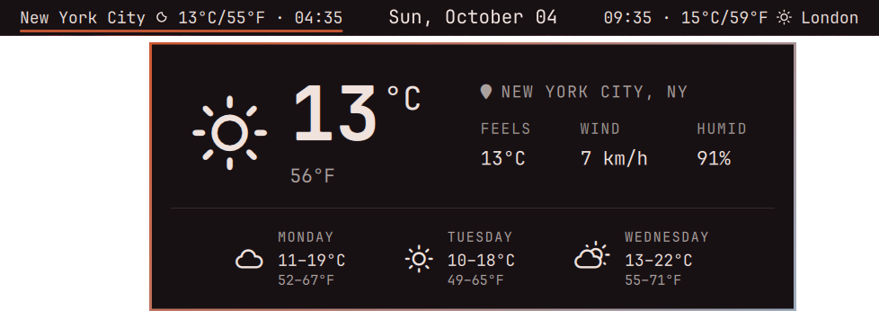
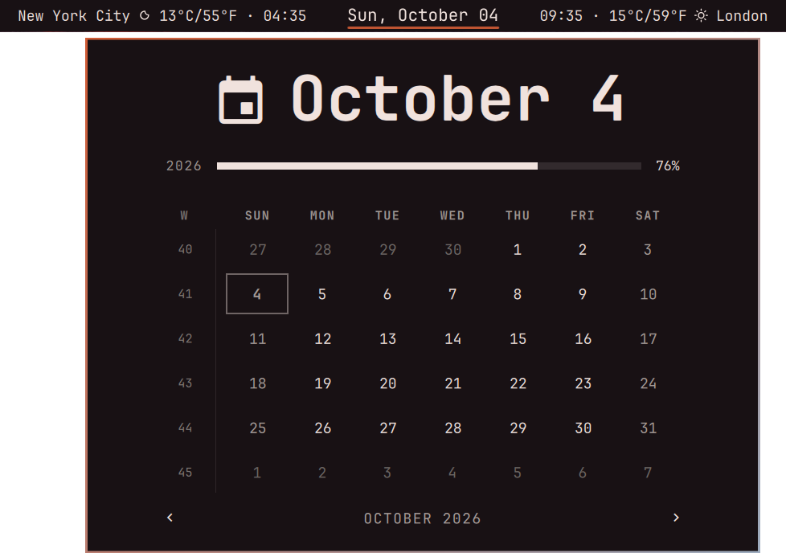

# Dual City

An [Omarchy](https://omarchy.org/) bar widget that puts two cities' weather and
local time on either side of today's date.


- **West to east.** The cities are sorted by longitude, so the western one is
  always on the left. The order never wraps across the international date line.
- **Read like a flight itinerary.** Each city shows its own local time, next
  to the date. A city that is already on tomorrow (or still on yesterday)
  gets a ⁺¹ or ⁻¹, the way an itinerary marks an overnight arrival.
  If you live in New York, at 11 PM London's time reads `04:00⁺¹`.
- **Click for more.** Clicking a city opens a popup with feels-like temperature, humidity,
  wind and a three-day forecast. Clicking the date opens Omarchy's own calendar,
  and middle-clicking a city refreshes its weather. One click moves between
  them; you never have to close one popup first.





Weather comes from [Open-Meteo](https://open-meteo.com/), which is free and
needs no API key. Each city checks it every 10 minutes.

## Install

```bash
omarchy plugin add https://github.com/benredrew/omarchy-dual-city --enable
```

Then, in `~/.config/omarchy/shell.json`, center the bar on the widget so the
date sits in the middle of the screen:

```json
"bar": {
  "centerAnchor": "benredrew.dual-city",
  ...
}
```

Without it the date can sit off-center, and the bar may log warnings when
you change the widget's settings.

## Choose your cities

Out of the box it shows New York City and London. To change them, give the
widget's entry in `shell.json` a `cities` list with exactly two cities. Their order
in the list doesn't matter.

```json
{
  "id": "benredrew.dual-city",
  "cities": [
    { "city": "Tokyo", "region": "JP", "latitude": 35.6895, "longitude": 139.69171, "timezone": "Asia/Tokyo" },
    { "city": "Chicago", "region": "IL", "latitude": 41.85003, "longitude": -87.65005, "timezone": "America/Chicago" }
  ]
}
```

| Field | What it does |
|---|---|
| `city`, `region` | The name on the bar. The popup shows both. |
| `latitude`, `longitude` | Where the weather comes from, and which side the city goes on |
| `timezone` | A full name such as `Europe/Paris`, not an abbreviation like `CET` |

`cities.json` in this repository has ready-made entries for the world's 100
largest cities. To look up any other city:

```bash
curl -s "https://geocoding-api.open-meteo.com/v1/search?name=Tokyo&count=1" \
  | jq '.results[0] | {name, admin1, latitude, longitude, timezone}'
```

Saving `shell.json` updates the bar immediately.

## Other settings

| Key | Default | What it does |
|---|---|---|
| `dateFormat` | `ddd, MMMM dd` | The date in the middle, in [Qt date format](https://doc.qt.io/qt-6/qml-qtqml-qt.html#formatDateTime-method) |

The calendar popup's own settings (week start, birth year and life
expectancy for its life-progress bar) are saved in the same entry when you set
them from the popup.

## Notes

- The date popup is Omarchy's stock calendar, loaded from
  `/usr/share/omarchy/shell/plugins/panels/clock/Panel.qml`. If a future
  Omarchy release moves that file, clicking the date will stop working,
  but the rest of the widget will keep running.
- Temperatures show in °C and °F.

## Credits

City data in `cities.json` comes from [GeoNames](https://www.geonames.org/)
(`cities15000`), licensed [CC BY 4.0](https://creativecommons.org/licenses/by/4.0/).
The list ranks cities by population within city limits, not by metro area.

## License

MIT. See `LICENSE`.
